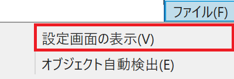
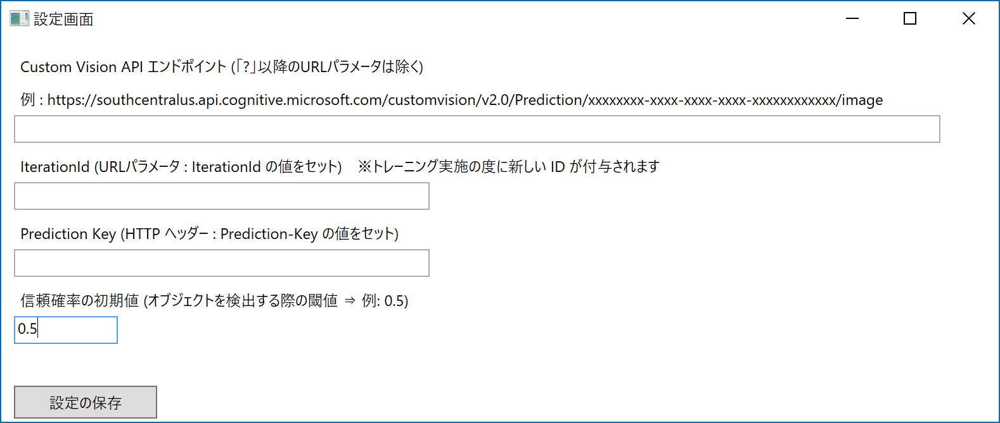

# CustomVisionWpfApp
Azure Cognitive Services - Custom Vison Service (https://customvision.ai/) の Object Detection 機能 (2018.05.25 時点で Limited Preview) を使った以下のような WPF アプリケーションです。

バイナリのインストーラーは、<a href="installer.zip">こちら</a>をクリックしてください。

Custom Vision Services で、オブジェクトを学習後、PERFORMANCE タブの Prediction URL をクリックして、そこに表示される情報を使い、「ファイル」メニューの「設定画面の表示」で入力をしてください。

オブジェクトが異なれば、矩形とテキストの色が変わります。オブジェクトをポイントすると、詳細が表示されます。
